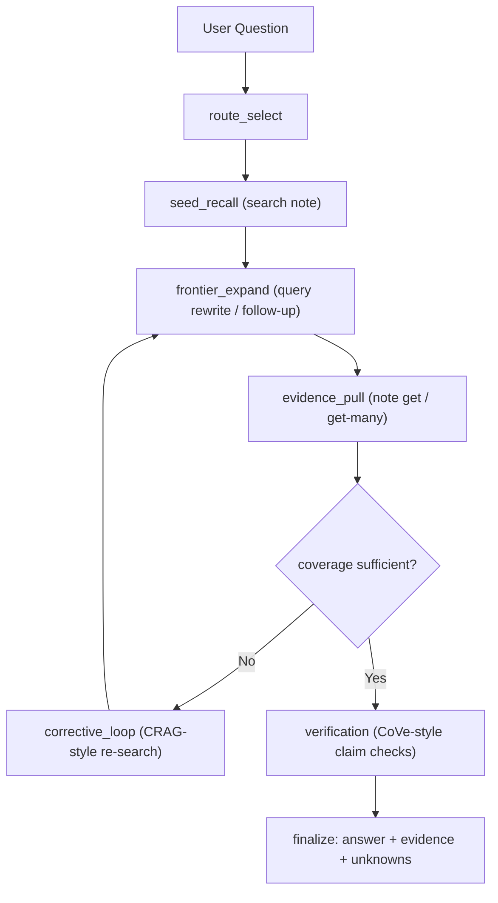

# Agentic RAG Architecture

## Purpose

Define the best current architecture for Kibela retrieval QA using `kibel` CLI, with explicit speed/exploration profiles and measurable quality gates.

## Core Architecture

## Route Selection

- `direct`: 単一事実・単一対象の質問。最小探索で回答。
- `multi_hop`: 複数条件/比較/依存関係がある質問。追質問を生成して反復探索。
- `global`: 組織横断サマリ・方針抽出。対象範囲を広げて要約。

## Execution Profiles

| Profile | Target | max_rounds | `search first` | max_note_fetch | max_cli_calls | Intended use |
|---|---:|---:|---:|---:|---:|---|
| `fast` | 最低レイテンシ | 1 | 8 | 4 | 8 | チャット中の即答 |
| `balanced` | 速度/精度の均衡 | 2 | 16 | 8 | 16 | 通常の調査 |
| `deep` | 最大探索 | 3 | 24 | 16 | 28 | 重要判断前の深掘り |

Default profile: `balanced`.

## Ranking and Stop Conditions

Ranking signal:
1. クエリ語一致（title/contentSummaryHtml）
2. 更新日時（`updatedAt`）
3. 範囲一致（group/folder/user filters）
4. 既取得証拠との差分（novelty）

Stop条件:
- `max_rounds` 到達
- `max_cli_calls` 到達
- 新規証拠増分ゼロが2回連続
- 検証可能な主要主張をカバー済み

## Output Contract

必須セクション:
1. `Answer`
2. `Evidence` (title + url/path + supporting point)
3. `Unknowns`

未検証主張は `Unknowns` へ送る。推測で埋めない。

## Evaluation Plan

## KPI

- `answer_supported_rate`: 回答主張のうち証拠で裏付け済み割合
- `citation_precision`: 提示引用のうち実際に主張を支持した割合
- `unknowns_rate`: 必要時に unknown を明示できた割合
- `avg_cli_calls`: 1問あたりCLI呼び出し平均
- `p95_latency_sec`: 95パーセンタイル応答時間

## Experiment Protocol

1. 固定質問セット（最低20問）を用意する。
2. `fast / balanced / deep` を同一セットで実行。
3. 各 run で `CLI call count` と `latency` を記録。
4. 回答を evidence 対照で採点し、KPI を集計する。
5. 採用基準:
   - `balanced` が `answer_supported_rate >= 0.90`
   - `citation_precision >= 0.95`
   - `p95_latency_sec` が許容値内（運用SLOに合わせる）

## Recommended Default

- 普段使いは `balanced`
- 時間優先は `fast`
- 監査・重要意思決定前は `deep`
