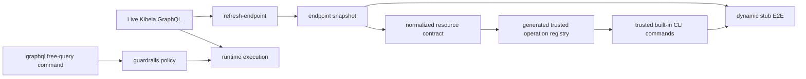
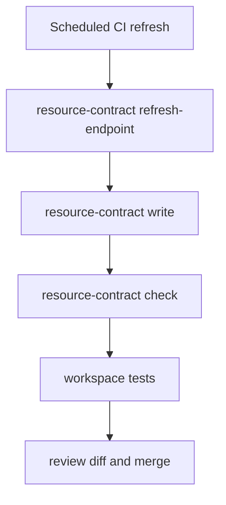

# GraphQL Tooling Roadmap (2026)

## Purpose
Define the target architecture for `kibel` as a high-quality GraphQL CLI/client system with low maintenance overhead and controlled flexibility.

## Current Model

### Source of truth
- Endpoint schema contract source: `research/schema/resource_contracts.endpoint.snapshot.json`
- Derived contract snapshot: `research/schema/resource_contracts.snapshot.json`
- Generated contract module: `crates/kibel-client/src/generated_resource_contracts.rs`
- createNote contract snapshot: `research/schema/create_note_contract.snapshot.json`
- createNote generated module: `crates/kibel-client/src/generated_create_note_contract.rs`

### Current strengths
- Deterministic contract checks for snapshot + generated modules.
- Dynamic GraphQL stub E2E based on committed contracts.
- Runtime schema adaptation path for createNote.
- Built-in operations are executed through generated trusted operation registry with runtime validation.

### Current gaps
- No explicit untrusted free-query lane with guardrails.
- Schema refresh governance is still mostly operator-driven.
- Free-query lane contract (JSON error normalization) is not yet specified.

## Target Model

### Design principles
1. Keep schema contracts deterministic and reviewable.
2. Separate trusted built-in operations from untrusted ad-hoc operations.
3. Make drift detection automatic and fail-closed.
4. Keep CLI UX stable while improving internals.

### Trusted vs untrusted lanes
- Trusted lane:
  - Built-in CLI commands (`note`, `search`, `group`, etc.).
  - Executed only from generated operation definitions validated against snapshot.
- Untrusted lane:
  - Explicit `graphql` command group for ad-hoc execution.
  - Requires runtime policy controls and bounded execution.

### Guardrails for untrusted lane
- Mandatory request timeout.
- Response-size limit and strict JSON output mode.
- Depth/cost budget checks are mandatory when schema metadata allows; otherwise fail-closed policy is required.
- Sensitive-field denylist policy hook (future phase).
- Error contract parity with built-in commands:
  - `--json` failures must always produce normalized `error.code`.

### Proposed baseline defaults (phase-2)
- Request timeout: 15s (hard cap: 60s).
- Response payload cap: 2 MiB (hard cap: 8 MiB).
- Max depth: 8.
- Max complexity budget: 1000 (if complexity metadata unavailable, reject unless `--unsafe-no-cost-check` is explicitly set).
- Mutations in free-query lane require explicit `--allow-mutation`.

## Architecture (Target)

## Lifecycle

## Rollout plan

### Phase 1: Trusted operation registry
- Generate operation registry metadata from contract snapshot.
- Validate operation name, root field, variable requirements in CI.
- Decide persisted query posture:
  - adopt APQ/safelist manifest if backend supports it,
  - otherwise declare explicit non-goal with rationale and keep local trusted registry.

### Phase 2: Untrusted lane
- Add `kibel graphql run` command.
- Require explicit opt-in flags for mutation execution.
- Apply timeout/output/depth-cost limits by default.
- Enforce JSON error-envelope parity tests.

### Phase 3: CI governance
- Scheduled workflow for refresh + check + report.
- Keep human review on snapshot diff before merge.

### Phase 4: createNote convergence
- Evaluate whether createNote dual-path remains necessary.
- If endpoint behavior stabilizes, reduce special-case logic.
- Convergence gate:
  - 3 consecutive refresh cycles without createNote schema drift,
  - parity tests for create/draft/error mapping all green,
  - rollback toggle and procedure verified.

## Definition of done
- Trusted built-in commands are fully generated/validated by contract flow.
- Free-query path is bounded and policy-controlled.
- Snapshot refresh can run unattended with reviewable artifacts.
- Docs (`README`, `architecture`, `schema-lifecycle`, `maintenance`) are consistent.
- Phase-level tests exist for registry integrity, guardrails, and JSON error normalization.

## Non-goals
- Generic GraphQL SDK generation for all schema types.
- Hidden automatic merge of schema changes without review.
